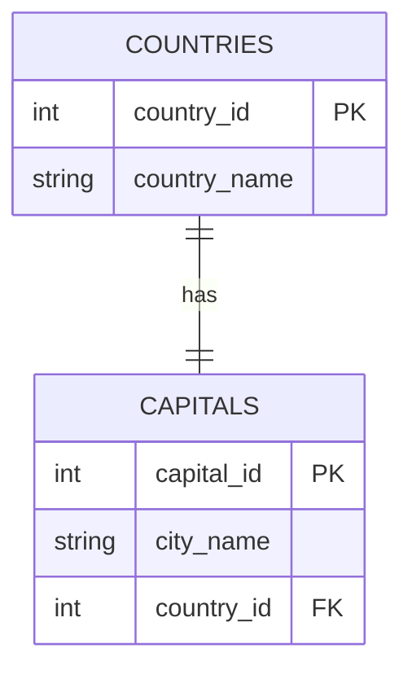
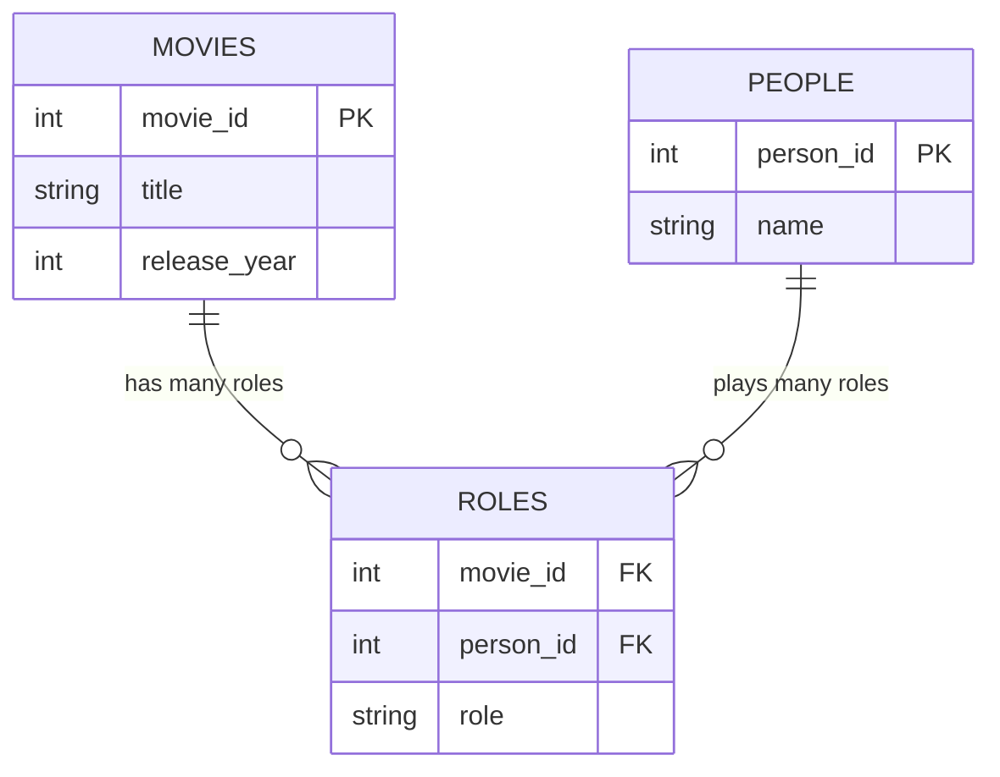
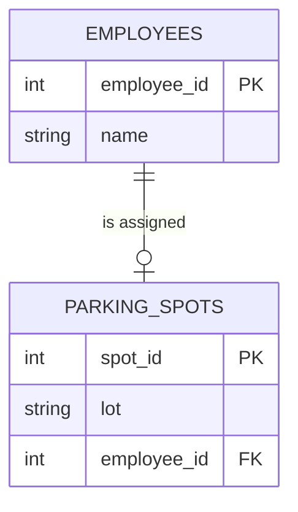
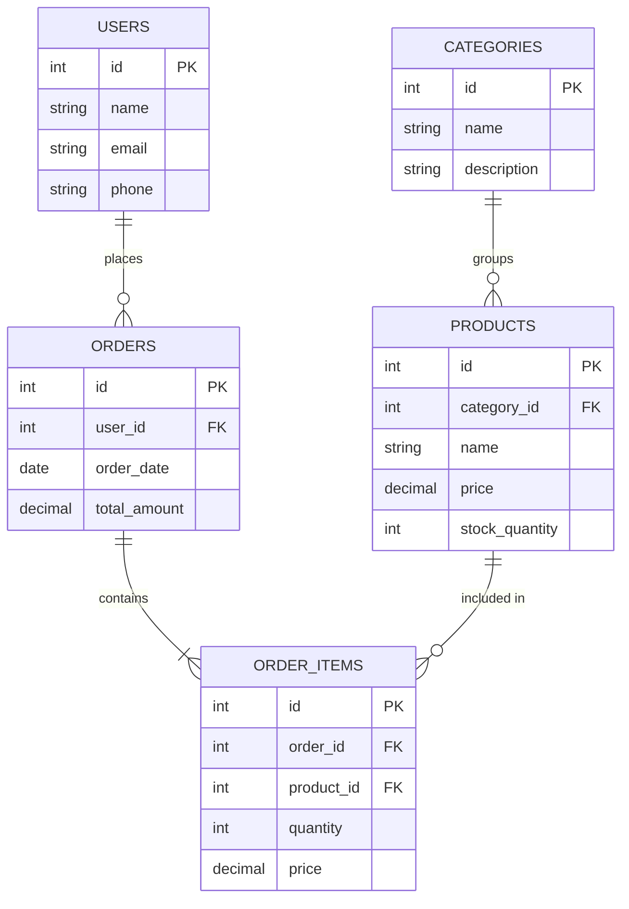

## On to Many 

```mermaid
erDiagram
    COUNTRIES ||--|| CAPITALS : "has"
    COUNTRIES {
        int country_id PK
        string country_name
    }
    CAPITALS {
        int capital_id PK
        string city_name
        int country_id FK
    }
```

## Many to Many from Movies.db ##

```mermaid
erDiagram
    MOVIES ||--o{ ROLES : "has many roles"
    PEOPLE ||--o{ ROLES : "plays many roles"
    MOVIES {
        int movie_id PK
        string title
        int release_year
    }
    PEOPLE {
        int person_id PK
        string name
    }
    ROLES {
        int movie_id FK
        int person_id FK
        string role
    }
```

## Optional side ##

```mermaid
erDiagram
    EMPLOYEES ||--o| PARKING_SPOTS : "is assigned"
    EMPLOYEES {
        int employee_id PK
        string name
    }
    PARKING_SPOTS {
        int spot_id PK
        string lot
        int employee_id FK
    }
```

# AI GENERATED DIAGRAM ##

```mermaid
erDiagram
    USERS ||--o{ ORDERS : "places"
    ORDERS ||--|{ ORDER_ITEMS : "contains"
    PRODUCTS ||--o{ ORDER_ITEMS : "included in"
    CATEGORIES ||--o{ PRODUCTS : "groups"

    USERS {
        int id PK
        string name
        string email
        string phone
    }

    ORDERS {
        int id PK
        int user_id FK
        date order_date
        decimal total_amount
    }

    ORDER_ITEMS {
        int id PK
        int order_id FK
        int product_id FK
        int quantity
        decimal price
    }

    PRODUCTS {
        int id PK
        int category_id FK
        string name
        decimal price
        int stock_quantity
    }

    CATEGORIES {
        int id PK
        string name
        string description
    }
```