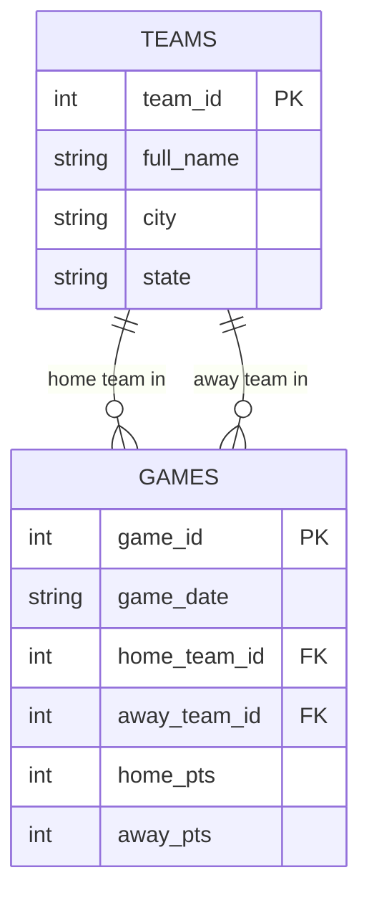
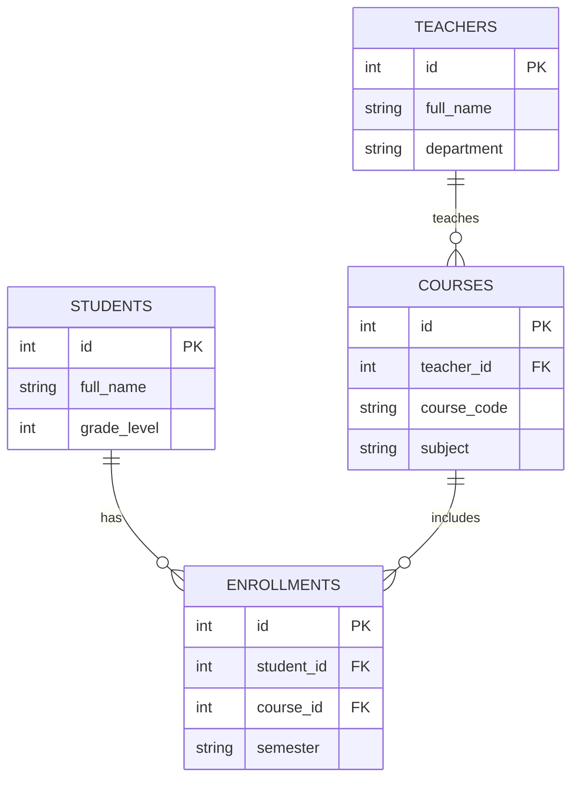

**Before you start:** rename this file to `unit3b_lastname.md`, using your own last name. Read `unit3b_Walkthrough.md` first. Commit and push when you're done.

**Name:**

---

# Unit 3b — Keys and Relationships

## 1. Which key?

For each table, decide: is the primary key **natural** (a real-world value that already exists, like an email) or **surrogate** (a made-up ID number)? Is it **composite** (more than one column)?

| Table | Primary key | Natural or surrogate? | Composite? |
|---|---|:-:|:-:|
| `teams` in `nba_5seasons.db` | `team_id` | surrogate | no |
| `player_season_stats` in `nba_5seasons.db` |  | | |
| A US state table | `state_abbrev` (OH, MI, PA…) | natural | no |
| The school's student records | `student_id` | surrogate | no |

**a.** The school could use a student's full name as the primary key instead of `student_id`. Give one reason that's a bad idea.

**Answer:** There is a possibiity of multiple students sharing the same name.


## 2. What a foreign key promises

**b.** In `denormalized_demo.db`, `games.home_team_id` is a foreign key to `teams.team_id`. If someone tries to insert a game with `home_team_id = 99` and there is no team 99, what should the database do? What is that rule called?

**Answer:** The database will reject the insertion because the forgein key doesnt have a primary key aligned with it. This is data integrity.


**c.** If team 6 were deleted from `teams`, what should happen to its rows in `games`? Name two different choices a designer could make.

**Answer:** The games statistics would be balanced to keep references. They could either delete all rows or they could only delete it once the other reference rows are gone.


## 3. Sort the relationships

**Choose from:** One-to-one · One-to-many · Many-to-many

| # | Relationship | Type |
|:-:|---|---|
| 1 | One team → its games this season | One-to-many |
| 2 | Students ↔ the courses they're enrolled in | Many-to-many |
| 3 | A person → their Social Security number | One-to-one  |
| 4 | A customer → their orders | One-to-many |
| 5 | Movies ↔ the actors in them | Many-to-many |
| 6 | A country → its capital city | One-to-one |

**d.** Pick either many-to-many row. Relational databases can't store a many-to-many directly. What table do you add, and what columns does it need?

**Answer:** You add a table in between to connect them together and seperate the data.


**e.** Not every database uses tables and keys. In a **graph** database (like the one behind Instagram's follow list), the same "who follows whom" relationship is stored as what two things? In a **key-value** store, how is a relationship handled?

**Answer:** It uses a key and only gives the data accosiated with it when you fetch the key.


## 4. Your first ER diagram

Here is the `denormalized_demo.db` fixed version as a Mermaid diagram. It already renders — push and look at it on GitHub or preview it in VS Code.



**Now make your own, using AI.** Follow the four steps in the walkthrough: plan it, prompt the AI, proof it, test it. A school schedule has these entities: **STUDENTS**, **COURSES**, **TEACHERS**, and an **ENROLLMENTS** junction table. Rules:

- One teacher teaches many courses; each course has one teacher.
- Students take many courses; courses have many students. (That's what ENROLLMENTS is for.)

Give every entity a primary key and at least two attributes. Mark the foreign keys.



**Paste the prompt you gave the AI.** If you used a PowerPoint picture, add the picture to your repo too.

```text

Create a complete database schema and Mermaid ER diagram for a School Schedule system.

Please follow these specific requirements:

1. Entities: Include TEACHERS, COURSES, STUDENTS, and an ENROLLMENTS junction table.
2. Relationships & Rules:
   - One teacher teaches many courses; each course has exactly one teacher.
   - Students take many courses; courses have many students (connected through ENROLLMENTS).
3. Primary & Foreign Keys:
   - Give every entity an 'id' as its primary key (PK).
   - Properly place all foreign keys (FK) to establish the relationships.
4. Attributes: Give every entity at least two non-key attributes (e.g., full_name, department, course_code, subject, grade_level, semester).

```

**f.** Which entity has two foreign keys? What should its primary key be?

**Answer:** enrollments, because it has course id and student id. The primary key is its own enrollment ID


**g.** What did you have to fix in the AI's diagram? If you didn't change anything, what did you check to make sure it was right?

**Answer:** I had to double check the entire stucture, and make sure it sorted the tables properly.


## Closing 3b — Vocabulary

| Term | Your definition |
|---|---|
| Entity | The container that has attributes |
| Attribute | Individual statistics of an entity |
| Natural key | Key made of data |
| Surrogate key | Key made of unrelated data |
| Composite key | Key made of two pieces of data combined |
| Referential integrity | Being able to reference things and keep both sides. You can't have a forgein key without a primary key, etc. |
| Junction table | Table in between two other tables to connect them |
| Cardinality | The number of distinct primary values |

**Partner check:** trade files. Read your partner's Mermaid code out loud, one relationship line at a time, as English ("one teacher, many courses"). If it doesn't read right, one of you has the crow's foot on the wrong end.
